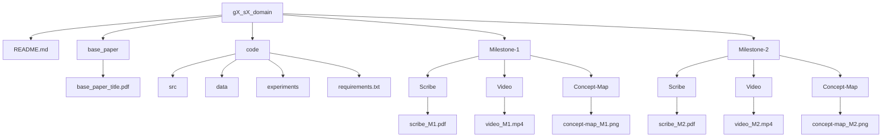

# gX_sX_domain-template

## 📁 Repository Structure (Follow Strictly)

```mermaid
flowchart TD
    A[gX_sX_domain]
    A --> B[README.md]

    A --> C[base_paper]
    C --> C1[base_paper_title.pdf]

    A --> D[code]
    D --> D1[src]
    D --> D2[data]
    D --> D3[experiments]
    D --> D4[requirements.txt]

    A --> E[Milestone-1]
    E --> E1[Scribe]
    E1 --> E1a[scribe_M1.pdf]
    E --> E2[Video]
    E2 --> E2a[video_M1.mp4]
    E --> E3[Concept-Map]
    E3 --> E3a[concept-map_M1.png]

    A --> F[Milestone-2]
    F --> F1[Scribe]
    F1 --> F1a[scribe_M2.pdf]
    F --> F2[Video]
    F2 --> F2a[video_M2.mp4]
    F --> F3[Concept-Map]
    F3 --> F3a[concept-map_M2.png]
```
